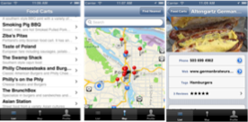
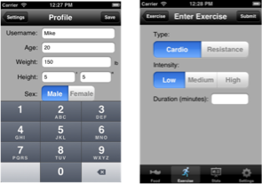

Call For Project Proposals

The Computer Science Department at Washington State University Vancouver announces a call for proposals for the capstone course, software design projects I/II.

This course aims to bring together all of the computer science coursework the student has taken, along with writing and communication skills acquired in non-CS courses, and give the students an opportunity in which they can demonstrate their skills and creatively design a substantial software system. All the programming language knowledge, algorithms, data structures, application domain knowledge and mathematics the students have acquired are brought to bear on a team project. The overall intent of the course is to give students an experience that is comparable to conducting a software development project in a professional setting.

**I. Scope of potential projects**

A potential project should be suitable for a team of 5 to 6 students, to work for two semesters (from August 2014 to May 2015). We are particularly interested in **mobile applications** , **web applications** and **computer/mobile games** .

In May 2015, a capstone project showcase will be held in WSUV campus. The final deliverables include the software product, as well as a user's manual.

Some sample capstone projects from previous years are listed as follows.

1. Portland Food Cart: a mobile app for searching, browsing, and writing reviews for Portland food carts.

2. Recipe Genie: a web application which searches for recipes on the Internet based on available ingredients and user's preferences.

3. Health Tracker: a mobile app for keeping track of exercises, food intakes, etc.

**II. Expected Involvement of industry sponsors**

The development of the software is free of charge to the sponsors. However, if the project requires specific hardware, software, or other resources, the sponsor is responsible for any additional cost of the project.

If the project is selected, the sponsor is expected to meet with the students at least one hour every two weeks, either face-to-face, or via video conference. At the end of the project, the sponsors are required to fill out an evaluation form for the project, which will be considered in the grading process. The sponsors are encouraged to attend the capstone showcase in May 2015.

**III. Licensing**

The software is by default owned by the student team. If there is a specific requirement for licensing, the sponsor should reach an agreement with the student team.

**IV. Application Procedure**

If you are interested in providing a potential project, please send a 1-page proposal, which includes the following information:

1. Contact information of the sponsor

2. A brief description of the software

3. The platform on which the software is built on, e.g., Web, iPhone/iPad, Android, Mac OS, Windows, etc.

4. Any addition requirements

The selected sponsors will be notified by **August 31, 2014**

**How to submit** : send a PDF proposal by email to one of the course instructors:

Dr. Xinghui Zhao ( [x.zhao@wsu.edu](mailto:x.zhao@wsu.edu))

Dr. Wayne Cochran ( [wcochran@vancouver.wsu.edu](mailto:wcochran@vancouver.wsu.edu))